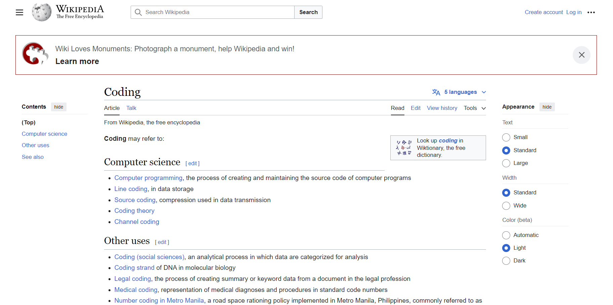

### Assignment Instructions:

---

1. **Break Down the UI into Components**  
   Take a look at the provided UI. Your task is to divide it into multiple React components. You don't need to write any code for this step. Simply use a pen and paper or a photo editing tool to visualize how the UI can be split into different components. This exercise will help you get a better understanding of component structure in React.



2. **Create a Greet Component**
    1. Create a new file called `Greet.jsx` and inside that file, write a `Greet` component using the **function declaration** syntax.
    2. Afterward, refactor the `Greet` component to use the **arrow function** syntax.
    3. Finally, register the `Greet` component in your `App.jsx` file so that you can see the result when running the app.

<br />

### Exercise: Rendering Multiple Components and Nesting Components

---

In this exercise, you will learn how to create multiple components and render one component inside another.

#### Step 1: Create a `Header` Component

1. Create a new file called `Header.jsx`.
2. Inside this file, create a functional component named `Header`.
3. The `Header` component should return a `<header>` element with the following:
    - A `<h1>` element with the text `"Welcome to My Website!"`
    - A `<nav>` element containing three links (`<a>`) with the text `"Home"`, `"About"`, and `"Contact"`.

#### Step 2: Create a `Footer` Component

1. Create a new file called `Footer.jsx`.
2. Inside this file, create a functional component named `Footer`.
3. The `Footer` component should return a `<footer>` element with a `<p>` containing the text `"© 2024 My Website"`.

#### Step 3: Create a `MainContent` Component

1. Create a new file called `MainContent.jsx`.
2. Inside this file, create a functional component named `MainContent`.
3. The `MainContent` component should return a `<main>` element containing:
    - A `<h2>` element with the text `"Main Content"`.
    - A `<p>` element with any text of your choice.

#### Step 4: Render Components Inside `App.jsx`

1. In your `App.jsx` file, import the `Header`, `MainContent`, and `Footer` components:

    ```jsx
    import Header from "./Header";
    import MainContent from "./MainContent";
    import Footer from "./Footer";
    ```

2. Inside the `App` component's return statement, render the three components inside a single `<div>`, in the following order:
    - `Header`
    - `MainContent`
    - `Footer`

Your `App.jsx` should look like this:

```jsx
function App() {
	return (
		<div>
			<Header />
			<MainContent />
			<Footer />
		</div>
	);
}

export default App;
```
